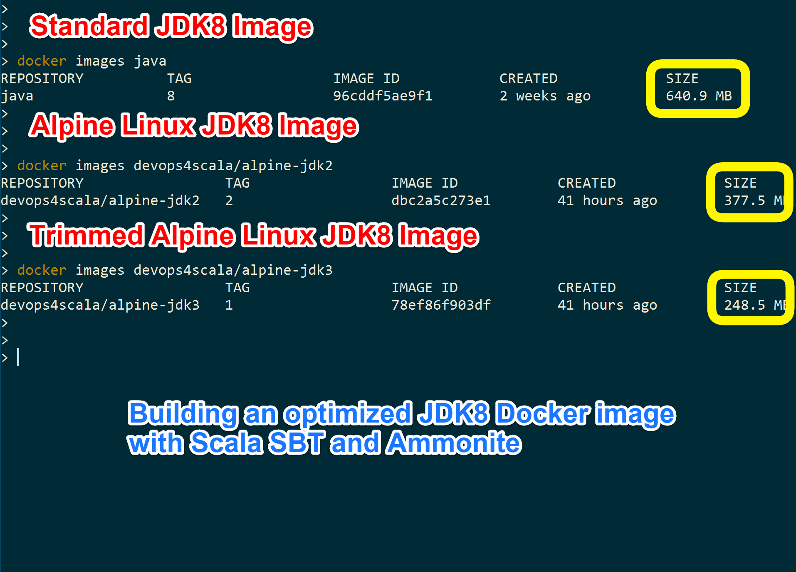

# Devops4Scala: building an optimized JDK8 Docker   image with Scala SBT and Ammonite



In a [previous post](http://michele.sciabarra.com/2016/09/19/devops/using-sbt-docker/) I started a series "Devops4Scala" describing how to use Scala for Devops tasks. The first post was about building Docker images using [SBT](http://www.scala-sbt.org) and the plugin `sbt-docker`. The plugin is pretty powerful but it does not allow to do  everything I needed for complex image builds.

In this post I will examine how to build a Docker image for Java Development Kit under Alpine Linux using SBT. To perform the required tasks I introduce another plugin I wrote, `sbt-mosaico`, extending `sbt-docker` and featuring *configuration files*, *automated download*, *Ammonite scripting* and more. I advise to read the past blog post about `sbt-docker` in order to fully understand this post, because takes for granted building Docker images with SBT.

 Since I am building a set of Docker images for Scala applications,  a base image with the Java Development Kit  is an absolute must. Scala is nowadays primarily a JVM language, although it can be  successfully compiled to Javascript, and a nascent native compiler also exists.

Furthermore, I want to use Alpine Linux as a basis for my images, because  it is very lightweight and it the de-facto standard for Docker images.

There are some "official" JDK images on Docker Hub built by Oracle, but they are not based on Alpine Linux, and they are also pretty big. There are also some images based on Alpine Linux with Sun JDK but they are not official. Last but not least there are open jdk based Alpine linux images. What I want to build is an image based on Alpine Linux *and* Oracle JDK that are as small as possible.

 Such an image cannot be legally distributed on the Docker HUB because it would violate the distribution agreement of Oracle JDK. However it is certainly legal to build an in-house image. So this blog post about how to build such an optimized image for internal use, that can be  handy in many cases.

All the scripts described in this post [can be found on GitHub](https://github.com/sciabarra/Devops4Scala/tree/master/download-script).

 <!-- more -->

## Use cases for building a JDK image

In this post I will  cover the following use cases for building  a JDK image:

- downloading software from internet (outside Docker)
- creation of a separate configuration files to parametrize the build
- last but not least,  processing of the downloaded software, using Ammonite Scala Scripts

All of those use cases cannot be covered with `sbt-docker` alone. For this purpose I developed an extension plugin named `sbt-mosaico` that I will use in this post for building more complex images.

But let's start doing it all in order.

# Downloading software for Docker images

Dockerfiles usually download the required software by themselves. You can to it in 2 ways. First way is to use the `ADD` command followed by an URL. The second way is to use a `RUN` command executing `wget` or `curl` to actually download your file.

Both the two solution are problematic. If you use `ADD`, by design, it will download the url at every build, because [a layer created with `ADD` is not cached](https://github.com/docker/docker/issues/15717). The rationale behind this behavior is explained in the linked issue: they do not trust http timestamps so they end up downloading every time. Unfortunately this behavior slows down a lot when you rebuild images, and it is a major issue in the building process, especially if you run those builds in a continuous integration chain.

The alternative suggested in the ticket itself, is to use a `RUN wget`, that works a bit better. However, this way the downloaded software is left inside the image. It eats precious space: this technique basically almost doubles the size of the image. The `wget` layer of an image is cached, so it does not download the software again, but also when you drop the images and rebuild them from scratch, you have to download the software again.

The solution is of course to download the image *before* building the image automating the download step with SBT. So let's see how to do it.

## Enabling `download` in SBT

First, you need the `sbt-mosaico` plugin, that is available on Maven Central. So all you need to do is to add in your `project/plugins.sbt`:

```
addSbtPlugin("com.sciabarra" % "sbt-mosaico" % "0.2")
```

and enable it with:

```
enablePlugins(MosaicoDockerPlugin)
```

Note this plugin depends on the `sbt-docker` plugin and it will automatically download and enable it.

Now you have a few extra tasks. The one we are interested is just `download`. Note it is an interactive command, so you can use it straight from the SBT prompt. For example, you can use  this task to download the Ammonite Scala Shell with just: `download https://git.io/vioDM amm`

**Note**: you do not actually *need* to download Ammonite to run the scripts I will describe later, since Ammonite is already integrated in `sbt-mosaico` and it will be download by SBT as a dependency.

## Download the requirements

Now that we have the `download` task we can use it to build a Docker image.  
Let's write  an `SBT` script for it. The full script is [here](https://github.com/sciabarra/Devops4Scala/blob/master/download-script/jdk1/build.sbt). We will need of course the url to download the JDK, so let's define a variable with it:

```
val jdkUrl = "http://download.oracle.com/otn-pub/java/jdk/8u101-b13/jdk-8u101-linux-x64.tar.gz"
```

However, if we download this archive and try to run in an alpine image, we will have a nasty surprise: it does not work, since it is dynamically linked with the standard `glibc`, and Alpine Linux uses `musl libc`. So we have no choice but to download and install also `glibc` shared libraries for Alpine. Luckily, those are available on the net, so let's declare another URL to download this other requirement:

```
val glibcUrl= "https://github.com/sgerrand/alpine-pkg-glibc/releases/download/2.23-r3/glibc-2.23-r3.apk"
```

So we can now first download the `glibc` using:

```
download.toTask(s" $glibcUrl glibc.apk").value
```

This code in a SBT build file will transform the input task (the interactive `download` task) in a task that can be performed automatically. It will "build" downloading the URL and store in the local `glibc.apk` file. It will also download only once. If the file is already there, it will not be downloaded again. The task returns the File object pointing to the local copy.

We can use the download task also to download the JDK, but JDK has an additional step required to be downloaded. It is protected by a cookie, requiring the acceptance of the license. The `download` task actually cover also those cases allowing to specify in the request  additional headers. So we can download the JDK with:

```
val oraCookie = "Cookie: oraclelicense=accept-securebackup-cookie"
download.toTask(s" $jdkUrl jdk.tgz $oraCookie").value
```

Now we have downloaded the files, the rest is pretty usual. This script however it is only the first version. There is more to say.

# Parametrizing the build script

Now we have a build script where we placed a number of constants inside. It is useful to actually place those constants in a separate, simple, non coded configuration file, to allow administrators and non programmers to change values easily. This is especially useful for something so volatile as an url.  Normally it is not possible in SBT out of the box. I thus developed for the `MosaicoDockerPlugin` a feature to read a property file.

When you enable the plugin, you get a `prp` settings  returning a Scala map. By default, it looks in a file named `mosaico.properties` in the current directory, but you can customize the location of the property files. Indeed this is the first thing we do now.

I created  [`jdk2`](https://github.com/sciabarra/Devops4Scala/tree/master/download-script/jdk2) project where I added this setting at the beginning:

```
prpLookup += baseDirectory.value.getParentFile -> "alpine"
```

This way the build will lookup for an `alpine.properties` in parent directory. I will share this configuration file in different subprojects. The configuration file is the following:

```
alpine.jdk2=devops4scala/alpine-jdk2:1
alpine.jdk3=devops4scala/alpine-jdk3:1
jdk.url=http://download.oracle.com/otn-pub/java/jdk/8u101-b13/jdk-8u101-linux-x64.tar.gz
glibc.url=https://github.com/sgerrand/alpine-pkg-glibc/releases/download/2.23-r3/glibc-2.23-r3.apk
```

We can see I put the names of the images I want to build, and the urls of the files to download.

To use a value from the configuration file I just need to use `prp.value("key.name")`. Remember, since it is an SBT task, you need to use `.value` to evaluate a task.  I get a hash map from where I can extract a value. Note that if there is not a value in the configuration file, I will get an exception in the build. This is what I want, because if I forget a key I should get an error. If insted I would like to get a default for a missing key, I can use `prp.value.getOrElse("key.name", "default value")`. So if the `key.name` does not exist I get the `default value`.

Let's  see it in action in this code in the `jdk2/build.sbt`:

```
imageNames in docker := Seq(ImageName(prp.value("alpine.jdk2")))
```

## Using properties in SBT tasks

Unfortunately in SBT we cannot use dynamic values in generic input tasks. When you want to use an SBT input task as a task with the `toTask`, you cannot use other tasks or settings. For this reason the `download` task (and also other `sbt-mosaico` tasks) do a configuration replacement before  execute the task. In practice this means you cannot write `${prp.value("glibc.url")}` in the `download` but instead you have to use this code:

```
Def.sequential(
  download.toTask(s" @glibc.url glibc.apk"),
  download.toTask(s" @jdk.url jdk.tgz $oraCookie")
).value
```

The notation `@glibc.url` and `@jdk.url` will be replaced by a configuration key in the input task directly. Everything starting with `@` will be replaced with the corresponing key in the configuration. Note  `$oraCookie` is instead just Scala string interpolation.

Incidentally, note I placed the two tasks in a "sequential" block to be sure they are executed in sequence. I do not wan to get a messy output because SBT tries acutally to execute tasks in parallel.

## Profile support

Actually I lied on the fact the plugin looks for property files with a `.properties` extension. It actually looks for 3 files in this order: first `.dist.properties` then `.properties` and finally `.local.properties`. The latest value will override the older value.

The idea is you can place your distribution default in the `.dist.properties`, your actual configuration in the `.properties` and finally you can add have a `.local.properties` to override locally the settings.

Furthermore, it is possible to set the system property `profile`, and it will be used as an additional extension. For example if I invoke SBT addding `-Dprofile=devel`, also the property files with extension `.devel.properties` will be loaded and used.

# Removing extra files in JDK

So far so good, we can build the image. However, if you check the size of the JDK image you will see it is 377 MB! Pretty big!

Actually in the JDK are included a lot of file not necessary for the execution of applications. In JDK are included source code of the library, the tuning tools visual vm and mission control, java db and many other stuff.

Unfortnately the usual solution of just removing those files at the end of the install does not work! The image won't be any smaller. What is needed is the ability to trim the JDK before actually placing it in the image. Thankfully, we are in the context of building images with a build tool so it is just matter of another build step.

We can perform this activity in many different ways, invoking a script. We could use a shell script for example, but at the cost of introducing a dependency on the system to be used to build our docker images. This is a problem because I want the kit to be usable on multiple systems, to build images for development as well as for production. We need to support all the development enviroments for bulding our images.

For those reasons I included a portable scripting shell based on Scala, [Ammonite](https://github.com/lihaoyi/Ammonite). The `sbt-mosaico` plugin includes support for executing Ammonite scripts. You need to enable it, so in your project definition you have to use something like this:

```
enablePlugins(MosaicoDockerPlugin,MosaicoAmmonitePlugin)
```

Then you will have a task `amm` that can execute Scala scripts. Here is the final build file:

```
prpLookup += baseDirectory.value.getParentFile -> "alpine"

imageNames in docker := Seq(ImageName(prp.value("alpine.jdk3")))

val oraCookie = "Cookie: oraclelicense=accept-securebackup-cookie"

dockerfile in docker := {
  val base = baseDirectory.value
  new Dockerfile {
    Def.sequential(
      download.toTask(s" @glibc.url glibc.apk"),
      download.toTask(s" @jdk.url jdk.tgz $oraCookie"),
      amm.toTask(s" trimjdk")
    ).value
    from("alpine:edge")
    copy(base/"glibc.apk", "/tmp")
    runRaw("apk add --allow-untrusted /tmp/*.apk  && rm /tmp/*.apk")
    add(base/"usr", "/usr")
    runRaw("ln -sf /usr/jdk* /usr/java ; chmod +x /usr/java/bin/*")
    env("JAVA_HOME", "/usr/java")
    env("PATH", "/bin:/sbin:/usr/bin:/usr/sbin:/usr/java/bin")
  }
}
```

You can note that after downloading the `jdk` I invoke a `trimjdk` script with `amm.toTask(s" trimjdk")`.

The script is mostly written in Scala, and you need no other dependency on the system. The scripts actually were tested both on Windows 10 and Mac OSX and they run just fine on both systems. Let's give a look at the script:


```
import $ivy.`org.rauschig:jarchivelib:0.7.0`
import org.rauschig.jarchivelib._
import java.io._
```

The strange `$ivy` imoport is the Ammonite syntax for declaring a dependency on a library available on maven central able to expand a `tar.gz`.

```
val exclude = "jdk1.8.0_\\d+/(src\\.zip|javafx-src\\.zip.*|db/.*|man/.*|include/.*|lib/(missioncontrol|visualvm)/.*|jre/lib/desktop/.*)".r
val infile = new File("jdk.tgz")
val base = pwd.toIO
val outdir = (pwd/"usr").toIO
outdir.mkdirs
```

Here we declare a regular expression to select files we do not want to extract, then source and target file.
The rest is just plain extraction code.

```
val arc = ArchiverFactory.createArchiver(ArchiveFormat.TAR, CompressionType.GZIP);
val str = arc.stream(infile)
var ent = str.getNextEntry
while (ent != null) {
  val curr = ent.getName
  exclude.findFirstIn(curr) match {
    case Some(_) => print(s"-")
    case None    => print("+")
      ent.extract(outdir)
  }
  ent = str.getNextEntry
}
```

If we build the image using this script we will end up with an image only 248 mb. Success!

# Conclusions

We have seen now how to improve our Docker4Scala build kit, learning how to automate downloading, configuring and scripting our applications.
